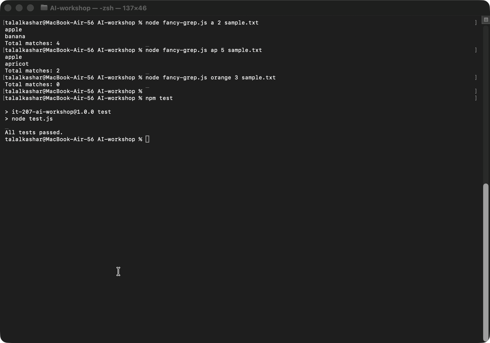

# Step 2 Test Results

I tested fancy-grep.js by running it against 3 different search patterns and I also ran the entire automated testing suite.

## Test 1: Output limited to the top "n" items

`node fancy-grep.js a 2 sample.txt` displayed only two (the top two) of the four lines that contain the pattern a, those being "apple" and "banana". It also reported `Total matches: 4`.

Test 1 demonstrates the functionality of limiting the amount of data displayed based on how many matches are found.

## Test 2: Fewer matches than the user requests

I ran `node fancy-grep.js ap 5 sample.txt`. The command displayed both "apple" and "apricot", which were the two lines that matched. It reported `Total matches: 2`. In this case, the program worked as expected because it displayed every available match even though the requested limit was larger.

## Test 3: No matches for the pattern

I ran `node fancy-grep.js orange 3 sample.txt`. It did not find any matching lines from the file and reported `Total matches: 0`.

## Testing using automation

After performing my manual testing I ran the command `npm test`. The results indicated that `All tests passed`. My automated testing suite tests all of the original grep, head, and count-words applications in addition to testing all of the Fancy Command application features.

## Screenshot

Below is an image of what happened in the terminal window during my testing.

